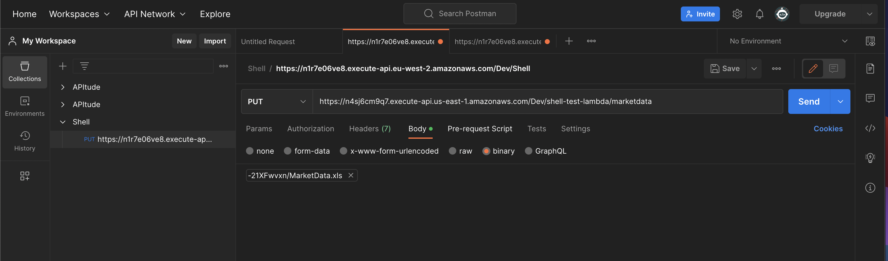
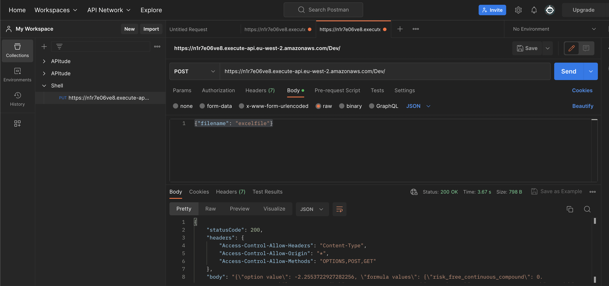
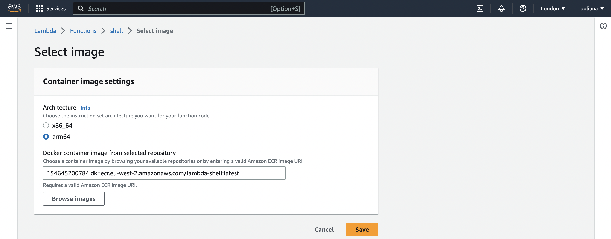

# options-present-value

options-present-value is a Python REST API that returns the present value of CALL and PUT options.

## endpoint 

### For uploading your spreadsheet with market data, you can use the endpoint below in Postman
PUT: https://n4sj6cm9q7.execute-api.us-east-1.amazonaws.com/Dev/shell-test-lambda/<your file name>

### For the upload, we need to change the body to binary


### After you upload your market data spreadsheet, you can call this POST API 
POST: https://n1r7e06ve8.execute-api.eu-west-2.amazonaws.com/Dev/

### You can pass your json body as in the image


### Prerequisites for creating a lambda container image
For creating a lambda container image, you need to have installed Docker and have previously created a role with the required permissions for ECR, Lambda and API attached to the services. 

```python

# build your Docker image with the command below
docker build -t <docker image name> .   

# run the command below to authenticate the Docker CLI to your Amazon ECR registry
aws ecr get-login-password --region <your region> | docker login --username AWS --password-stdin <your AWS account id>.dkr.ecr.<your region>.amazonaws.com

# Create a repository in Amazon ECR using the below command
aws ecr create-repository --repository-name <repository name> --image-scanning-configuration scanOnPush=true --image-tag-mutability MUTABLE

# run the below command to tag your local image into your Amazon ECR repository as the latest version.
docker tag <your docker image name>:latest <your AWS account id>.dkr.ecr.<your region>.amazonaws.com/<your ECR repository>:latest

# now the command for deploying your local image to the Amazon ECR repository.
docker push <your account id>.dkr.ecr.<your region>.amazonaws.com/lambda-shell:latest

#Create the lambda function
aws lambda create-function \
  --function-name lambda-shell \
  --package-type Image \
  --code ImageUri=<your AWS account id>.dkr.ecr.u<your region>.amazonaws.com/lambda-shell:latest \
  --role arn:aws:iam::<your AWS account id>:role/{your own role}

```
#### Note: if you build your docker image in a arm64 architecture device, you'll need to change the architecture for your lambda in console. Go to your lambda function, hit 'Deploy new image' button, select arm64 architecture and save. 
#### Increase the Timeout in the Configuration panel.


## Contributing

Pull requests are welcome. For major changes, please open an issue first
to discuss what you would like to change.
